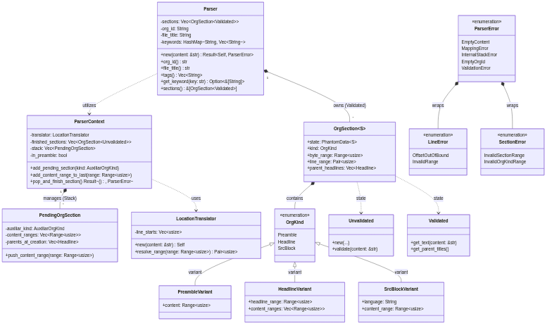
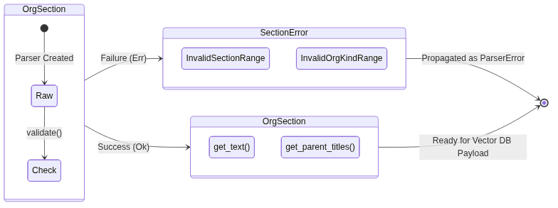
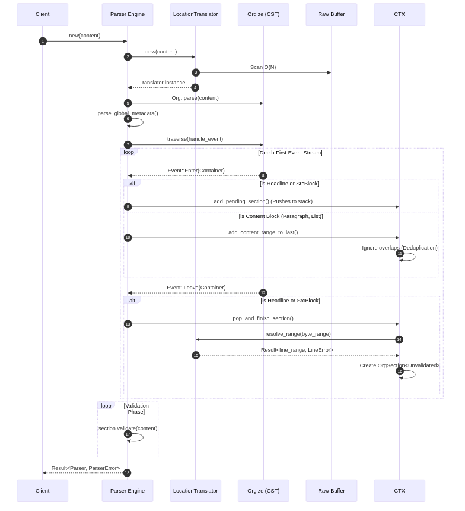
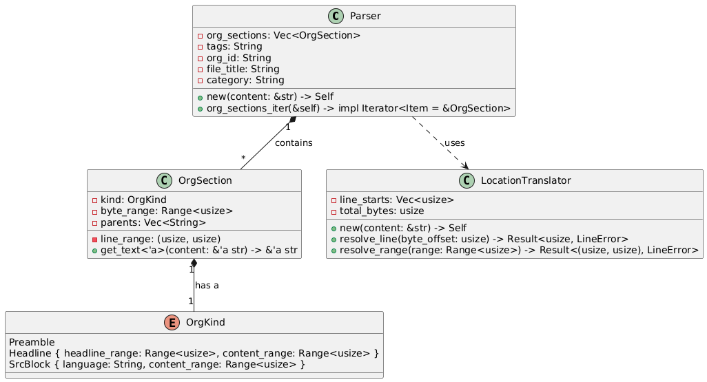
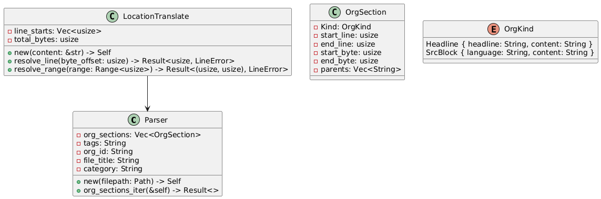

#+TITLE: vector-roam-mcp: Parser & Physical Mapping Design
#+AUTHOR: Ponnshe
#+DATE: [2026-02-18]
#+DESCRIPTION: Technical specification for metadata extraction and physical coordinate mapping in Org-roam files.
#+LANGUAGE: en

* Introduction
This document defines the architecture of the Parser component for the vector-roam-mcp project. The primary goal is to transform .org files into semantic chunks while maintaining an exact reference to their physical coordinates (bytes and lines) to enable RAG operations and atomic editing by AI agents.

* Technical Objectives
- *High-Fidelity Physical Mapping*: Integrate the =orgize v0.10= Concrete Syntax Tree (CST) to obtain absolute byte offsets.
- *Memory Efficiency*: Implement a "Zero-copy" strategy by using Range<usize> instead of duplicating content into Strings.
- *Coordinate Resolution*: Guarantee byte-offset to line-number translation in O(log L) time.
- *Context Preservation*: Build hierarchical "Breadcrumbs" for each section to enrich vector embeddings.

* System Architecture

** Class Diagram
#+begin_src mermaid :file diagrams/parser_class_diagram.png
classDiagram
    class Parser {
        -sections: Vec~OrgSection~Validated~~
        -org_id: String
        -file_title: String
        -keywords: HashMap~String, Vec~String~~
        +new(content: &str) Result~Self, ParserError~
        +org_id() str
        +file_title() str
        +tags() Vec~String~
        +get_keyword(key: str) Option~&[String]~
        +sections() &[OrgSection~Validated~]
    }

    class ParserContext {
        -translator: LocationTranslator
        -finished_sections: Vec~OrgSection~Unvalidated~~
        -stack: Vec~PendingOrgSection~
        -in_preamble: bool
        +add_pending_section(kind: AuxiliarOrgKind)
        +add_content_range_to_last(range: Range~usize~)
        +pop_and_finish_section() Result~(), ParserError~
    }

    class PendingOrgSection {
        -auxiliar_kind: AuxiliarOrgKind
        -content_ranges: Vec~Range~usize~~
        -parents_at_creation: Vec~Headline~
        +push_content_range(range: Range~usize~)
    }

    class LocationTranslator {
        -line_starts: Vec~usize~
        +new(content: &str) Self
        +resolve_range(range: Range~usize~) Pair~usize~
    }

    class OrgSection~S~ {
        +state: PhantomData~S~
        +kind: OrgKind
        +byte_range: Range~usize~
        +line_range: Pair~usize~
        +parent_headlines: Vec~Headline~
    }

    class ParserError {
        <<enumeration>>
        EmptyContent
        MappingError
        InternalStackError
        EmptyOrgId
        ValidationError
    }

    class LineError {
        <<enumeration>>
        OffsetOutOfBound
        InvalidRange
    }

    class SectionError {
        <<enumeration>>
        InvalidSectionRange
        InvalidOrgKindRange
    }

    class OrgKind {
        <<enumeration>>
        Preamble
        Headline
        SrcBlock
    }

    class PreambleVariant {
        +content: Range~usize~
    }

    class HeadlineVariant {
        +headline_range: Range~usize~
        +content_ranges: Vec~Range~usize~~
    }

    class SrcBlockVariant {
        +language: String
        +content_range: Range~usize~
    }

    class Unvalidated {
        +new(...)
        +validate(content: &str)
    }

    class Validated {
        +get_text(content: &str)
        +get_parent_titles()
    }

    Parser "1" *-- "*" OrgSection : owns (Validated)
    Parser ..> ParserContext : utilizes
    ParserContext ..> LocationTranslator : uses
    ParserContext "1" *-- "*" PendingOrgSection : manages (Stack)
    ParserError *-- LineError : wraps
    ParserError *-- SectionError : wraps
    OrgSection *-- OrgKind : contains
    OrgKind <|-- PreambleVariant : variant
    OrgKind <|-- HeadlineVariant : variant
    OrgKind <|-- SrcBlockVariant : variant
    OrgSection ..> Unvalidated : state
    OrgSection ..> Validated : state
#+end_src

#+RESULTS:

** State Diagram
#+begin_src mermaid :file diagrams/type_state_flow.png
stateDiagram-v2
    direction LR

    state "OrgSection<Unvalidated>" as Unv {
        [*] --> Raw : Parser Created
        Raw --> Check : validate()
    }

    state "OrgSection<Validated>" as Val {
        get_text()
        get_parent_titles()
    }

    state "SectionError" as Err {
        InvalidSectionRange
        InvalidOrgKindRange
    }

    Unv --> Val : Success (Ok)
    Unv --> Err : Failure (Err)
    Err --> [*] : Propagated as ParserError
    Val --> [*] : Ready for Vector DB Payload
#+end_src

#+RESULTS:

** Sequence Diagram
#+begin_src mermaid :file diagrams/parser_seq_diagram.png
sequenceDiagram
    autonumber
    participant C as Client
    participant P as Parser Engine
    participant LT as LocationTranslator
    participant O as Orgize (CST)
    participant B as Raw Buffer

    C->>P: new(content)
    P->>LT: new(content)
    LT->>B: Scan O(N)
    LT-->>P: Translator instance
    P->>O: Org::parse(content)
    P->>P: parse_global_metadata()
    P->>O: traverse(handle_event)

    loop Depth-First Event Stream
        O-->>P: Event::Enter(Container)
        alt is Headline or SrcBlock
            P->>CTX: add_pending_section() (Pushes to stack)
        else is Content Block (Paragraph, List)
            P->>CTX: add_content_range_to_last()
            CTX->>CTX: Ignore overlaps (Deduplication)
        end
        
        O-->>P: Event::Leave(Container)
        alt is Headline or SrcBlock
            P->>CTX: pop_and_finish_section()
            CTX->>LT: resolve_range(byte_range)
            LT-->>CTX: Result<line_range, LineError>
            CTX->>CTX: Create OrgSection<Unvalidated>
        end
    end

    loop Validation Phase
        P->>P: section.validate(content)
    end

    P-->>C: Result<Parser, ParserError>
#+end_src

#+RESULTS:

** Main Components
*** Parser & Context Engine
The ~Parser~ manages global metadata (Keywords, IDs, Tags) and initiates the AST traversal. Because ~orgize~ outputs a flat stream of DFS events, the parser uses a ~ParserContext~ to maintain a stateful stack (~Vec<PendingOrgSection>~).
- *PendingOrgSection*: Tracks active structural nodes (Headlines, SrcBlocks) and accumulates content ranges. It actively prevents range duplication by verifying if a new child block falls within an already captured range.

*** LocationTranslator
Processes the file buffer in a single $O(N)$ pass to build a line-start index (~line_starts~). It enables the system to translate any byte offset from the CST into a human-readable line number using binary search ($O(\log L)$).

*** Error Subsystem
Errors are strongly typed using ~thiserror~:
- *LineError*: Triggered by the ~LocationTranslator~ for out-of-bounds byte offsets or mathematically invalid ranges (start > end).
- *SectionError*: Triggered during the Validation phase if an ~OrgSection~ range splits a UTF-8 character boundary or extends beyond the buffer size.
- *ParserError*: The global enum wrapping internal failures, missing mandatory metadata (~EmptyOrgId~), or underlying mapping/validation errors.

*** OrgSection<S>
The atomic unit of the parser, implementing the **Type State Pattern** to ensure memory safety and data integrity:
- *Unvalidated*: The initial state where ranges are stored but not yet verified against the buffer boundaries.
- *Validated*: The "ready-to-use" state. Only validated sections can access methods like ~get_text()~ or ~get_parent_titles()~.
It holds lightweight handles (~Vec<Headline>~) to the CST, maintaining a live link to the document hierarchy without duplicating strings.

*** OrgKind (Enum)
- *Preamble*: Captures only non-metadata text (e.g., introductory paragraphs or notes) found before the first headline. It does not handle global file properties (like ~#+TITLE~ or ~#+TAGS~), which are managed as structured data by the ~Parser~.
- *Headline*: A semantic union between a headline's title and its immediate content. It supports multiple ~content_ranges~ to account for text fragmented by property drawers or sub-headlines.
- *SrcBlock*: Code blocks with language metadata. Its ~get_text~ implementation automatically wraps the content in Markdown backticks to optimize compatibility with LLM encoders.
* Design Decisions (Rationale)
1) *Stack-Based DFS Traversal*: Headlines in Org-mode encompass their entire sub-tree physically. We intercept ~Event::Enter~ and ~Event::Leave~ to build a stack, calculating headline ranges based on the first newline character (~\n~) relative to the start to break the spatial inheritance and avoid duplicating text in the RAG chunks.
2) *Safety via Type State Pattern*: We use ~Unvalidated~ and ~Validated~ markers to enforce at compile-time that no text extraction occurs before verifying buffer boundaries. This prevents runtime panics when slicing strings with multi-byte UTF-8 characters.
3) *Semantic Formatting over Pure Zero-Copy*: While we use ~Range<usize>~ to point to the buffer, ~get_text()~ returns a owned ~String~. This allows joining fragmented content ranges and injecting Markdown syntax (e.g., code blocks) to optimize the text for LLM embedding and retrieval (RAG).
4) *Live Hierarchy via Handles*: Instead of copying titles as strings, we store ~Vec<Headline>~. These are lightweight handles to the Rowan CST, allowing the system to query live metadata (tags, properties) without redundant parsing or data duplication.
5) *O(log N) Coordinate Resolution*: Using a pre-computed ~line_starts~ vector in the ~LocationTranslator~ ensures that any byte offset from the CST can be mapped to a physical line number instantly, facilitating exact AI-driven edits.
6) *Immutability & Thread Safety*: ~OrgSection~ fields are immutable once validated. This ensures that the sections can be safely shared across threads during the parallel indexing phase in the vector database.

* The Graveyard: Previous Designs
This section preserves the "failed" or suboptimal iterations of the architecture to provide historical context and prevent the re-introduction of discarded patterns.

** Iteration 3: The Type-State without Stack (Matryoshka Failure)
This was the first design utilizing the Type State Pattern (~Unvalidated~ / ~Validated~). It attempted to parse the CST by looking at nodes individually without maintaining a traversal state.
*** Class Diagram
#+begin_src mermaid :file diagrams/parser_class_diagram_iteration3.png
classDiagram
    class Parser {
        -sections: Vec~OrgSection~Validated~~
        -org_id: String
        -file_title: String
        -tags: Vec~String~
        -category: Option~String~
        +new(content: &str) Self
        +sections_iter() Iterator
    }

    class LocationTranslator {
        -line_starts: Vec~usize~
        +new(content: &str) Self
        +resolve_range(range: Range~usize~) Pair~usize~
    }

    class OrgSection~S~ {
        +state: PhantomData~S~
        +kind: OrgKind
        +byte_range: Range~usize~
        +line_range: Pair~usize~
        +parent_headlines: Vec~Headline~
    }

    class OrgKind {
        <<enumeration>>
        Preamble
        Headline
        SrcBlock
    }

    class PreambleVariant {
        +content: Range~usize~
    }

    class HeadlineVariant {
        +headline_range: Range~usize~
        +content_ranges: Vec~Range~usize~~
    }

    class SrcBlockVariant {
        +language: String
        +content_range: Range~usize~
    }

    class Unvalidated {
        +new(...)
        +validate(content: &str)
    }

    class Validated {
        +get_text(content: &str)
        +get_parent_titles()
    }

    Parser "1" *-- "*" OrgSection : owns (Validated)
    Parser ..> LocationTranslator : uses
    OrgSection *-- OrgKind : contains
    OrgKind <|-- PreambleVariant : variant
    OrgKind <|-- HeadlineVariant : variant
    OrgKind <|-- SrcBlockVariant : variant
    OrgSection ..> Unvalidated : state
    OrgSection ..> Validated : state
#+end_src

*** State Diagram
#+begin_src mermaid :file diagrams/type_state_flow_it3.png
stateDiagram-v2
    direction LR

    state "OrgSection<Unvalidated>" as Unv {
        [*] --> Raw : Parser Created
        Raw --> Check : validate()
    }

    state "OrgSection<Validated>" as Val {
        get_text()
        get_parent_titles()
    }

    Unv --> Val : Success (Ok)
    Unv --> Error : Failure (Err)
    Error --> [*]
    Val --> [*] : Ready for Vector DB
#+end_src

*** Sequence Diagram
#+begin_src mermaid :file diagrams/parser_seq_diagram_it3.png
sequenceDiagram
    autonumber
    participant C as Client
    participant P as Parser Engine
    participant LT as LocationTranslator
    participant O as Orgize (CST)
    participant B as Raw Buffer

    C->>P: new(content)
    P->>LT: new(content)
    LT->>B: Scan O(N)
    LT-->>P: Translator instance
    P->>O: Org::parse(content)
    O-->>P: Syntax Tree

    loop For each Node in CST
        P->>LT: resolve_range(node_range)
        LT-->>P: line_range
        P->>P: Create OrgSection<Unvalidated>
        P->>B: validate(content)
        alt is valid
            P->>P: Store OrgSection<Validated>
        else is invalid
            P->>P: Handle Error
        end
    end

    P-->>C: Vec<OrgSection<Validated>>
#+end_src

*** Post-Mortem Analysis
- *The Matryoshka Effect*: By mapping directly to the ~Headline~ node's full range in ~orgize~, a parent headline captured the text of *all* its child sub-headlines. This duplicated content recursively, poisoning the vector database payloads.
- *Missing Event Stack*: Because it lacked a ~ParserContext~ stack, it couldn't dynamically track when an ~Event::Enter~ happened versus an ~Event::Leave~, making it impossible to correctly append isolated ~Paragraph~ or ~List~ blocks to their proper parent headline.
- *Brittle Title Isolation*: It relied on ~hdl.section()~ to find where a title ended. If a headline had no immediate text before a sub-headline, ~hdl.section()~ returned ~None~, causing the parser to swallow the entire subtree's range.

** Iteration 2: The Range-Based Hybrid (Pre-Validation)
This iteration introduced the use of CST ranges to achieve a semi-zero-copy architecture. It attempted to decouple the physical location from the semantic content but failed to account for the strictness of Rust's ownership and the complexities of RAG-optimized text.

#+begin_src plantuml :file ./diagrams/parser_structure2.png
@startuml
class Parser {
    - org_sections: Vec<OrgSection>
    - tags: String
    - org_id: String
    - file_title: String
    - category: String

    + new(content: &str) -> Self
    + org_sections_iter(&self) -> impl Iterator<Item = &OrgSection>
}

class OrgSection {
    - kind: OrgKind
    - line_range: (usize, usize)
    - byte_range: Range<usize>
    - parents: Vec<String>

    + get_text<'a>(content: &'a str) -> &'a str 
}

class LocationTranslator {
    - line_starts: Vec<usize>
    - total_bytes: usize

    + new(content: &str) -> Self
    + resolve_line(byte_offset: usize) -> Result<usize, LineError>
    + resolve_range(range: Range<usize>) -> Result<(usize, usize), LineError>
}

enum OrgKind {
    Preamble
    Headline { headline_range: Range<usize>, content_range: Range<usize> }
    SrcBlock { language: String, content_range: Range<usize> }
}

Parser "1" *-- "*" OrgSection : contains
OrgSection "1" *-- "1" OrgKind : has a
Parser ..> LocationTranslator : uses
@enduml
#+end_src

*** Post-Mortem Analysis
- **The Validation Gap**: The design assumed that any range extracted from the CST was safe to use. It lacked a mechanism to prevent out-of-bounds or UTF-8 boundary errors before accessing the buffer, leading to potential runtime panics.
- **Hierarchy Decay**: Storing ~parents~ as a ~Vec<String>~ was a premature optimization that broke the link with the live CST. This made it impossible to access additional headline metadata (like tags or properties) without re-parsing.
- **The "Zero-Copy" Illusion**: The ~get_text -> &str~ signature was technically impossible for fragmented sections (like Headlines with multiple content blocks) or formatted blocks (SrcBlocks), as these require memory allocation to present a unified string to the LLM.
- **Oversimplified OrgKind**: It assumed ~Headline~ only had one ~content_range~, ignoring that headlines can contain multiple disconnected text fragments separated by sub-headlines or drawers.

*** Lessons Learned & Evolution
1. **Type State Pattern**: The need for safety led to the implementation of ~Unvalidated~ and ~Validated~ states, moving the "permission" to read text into the type system itself.
2. **Handles over Strings**: Realizing that ~Headline~ objects from ~orgize~ are lightweight handles allowed us to store a ~Vec<Headline>~, keeping the hierarchy "live" and queryable.
3. **Semantic Concatenation**: We accepted that for RAG (Retrieval-Augmented Generation), a ~String~ with clean formatting is more valuable than a raw ~&str~ reference to "noisy" original text.

** Iteration 1: The String-Heavy Data Model
Initially, the design focused on immediate data extraction rather than structured mapping. It treated structural components as passive data containers.

#+begin_src plantuml :results file :file ./diagrams/parser_structure1.png
@startuml
class Parser {
    - org_sections: Vec<OrgSection>
    - tags: String
    - org_id: String
    - file_title: String
    - category: String

    + new(filepath: Path) -> Self
    + org_sections_iter(&self) -> Result<>
}

class OrgSection {
    - Kind: OrgKind
    - start_line: usize
    - end_line: usize
    - start_byte: usize
    - end_byte: usize
    - parents: Vec<String>
}

class LocationTranslate {
    - line_starts: Vec<usize>
    - total_bytes: usize

    + new(content: &str) -> Self
    + resolve_line(byte_offset: usize) -> Result<usize, LineError>
    + resolve_range(range: Range<usize>) -> Result<(usize, usize), LineError>
}

enum OrgKind {
    Headline { headline: String, content: String }
    SrcBlock { language: String, content: String }
}

LocationTranslate --> Parser
@enduml
#+end_src

*** Post-Mortem Analysis
- *String Bloating*: Storing content as ~String~ inside the enum would cause massive memory overhead, essentially duplicating the entire file buffer in RAM for every parsed section.
- *Data Class Syndrome*: ~OrgSection~ was a "dumb" container. It lacked the behavior necessary to resolve its own text, forcing the ~Parser~ to become a "God Object".
- *I/O Inefficiency*: The ~new(filepath: Path)~ signature implied the parser was responsible for file I/O, violating the Principle of Single Responsibility and making the component harder to test in isolation.

*** Lessons Learned & Evolution
The transition from Iteration 1 to the next architecture was driven by three key engineering realizations:

1. *The Range-Based Paradigm*: Instead of "taking" the data, we now "point" to it. Using ~std::ops::Range<usize>~ allows the system to remain "zero-copy" (ish), keeping the memory footprint minimal regardless of the note's size.
2. *CST over AST*: The discovery of ~orgize~ v0.10 and the *Rowan* engine changed the project from "guessing" locations to having absolute coordinate certainty. This allowed us to ditch manual newline counting in favor of the ~LocationTranslator~'s binary search.
3. *Semantic Hierarchy*: We realized that ~Headline~ ranges in Rowan are nested (parents physically contain children). This forced a shift from simple linear iteration to a stack-based or recursive traversal to avoid indexing redundant, overlapping data.

* License
This design and its subsequent implementation are distributed under the terms of the **GPLv3** license.
